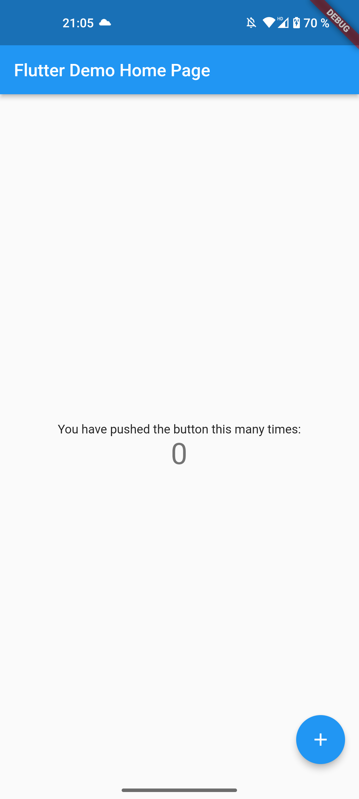

---

title: "Improving the little things"

date: 2023-03-11T10:00:00+02:00

---

# Improving the little things

In this blog post you'll learn which small changes you can do for your app, in order to create a better experience for your users.
We're focussing on Flutter apps for Android and iOS.

## Acoustic and haptic feedback for a better UX

Flutter has various APIs to enrich the UX with haptic or audio feedback. 

The first API is [HapticFeedback](https://api.flutter.dev/flutter/services/HapticFeedback-class.html). It vibrates the device according to the method names.

```dart
HapticFeedback.lightImpact();
HapticFeedback.mediumImpact();
HapticFeedback.heavyImpact();

HapticFeedback.selectionClick();
HapticFeedback.vibrate();
```

See for example this tweet as an example

<blockquote class="twitter-tweet" data-dnt="true"><p lang="en" dir="ltr">At <a href="https://twitter.com/visible_health?ref_src=twsrc%5Etfw">@visible_health</a> we also have this little tooltip when dragging across the bars in the plot which has very light haptic feedback on each entry, feels kinda nice <a href="https://t.co/SbzH1FlaGt">pic.twitter.com/SbzH1FlaGt</a></p>&mdash; Dominik Roszkowski (@OrestesGaolin) <a href="https://twitter.com/OrestesGaolin/status/1632720877841178625?ref_src=twsrc%5Etfw">March 6, 2023</a></blockquote> <script async src="https://platform.twitter.com/widgets.js" charset="utf-8"></script>

Then there's the [SystemSound](https://api.flutter.dev/flutter/services/SystemSoundType.html) API. It adds acoustic feedback. Please be aware that it's just partly supported depending on the platform. 

```dart
// SystemSoundType.alert is only supported on desktop platforms
SystemSound.play(SystemSoundType.alert);
SystemSound.play(SystemSoundType.click);
```

The [Feedback API](https://api.flutter.dev/flutter/material/Feedback-class.html) is for adding feedback which is also usable for accessibility concerns. 

```dart
class WidgetWithWrappedHandler extends StatelessWidget {
  const WidgetWithWrappedHandler({super.key});

  @override
  Widget build(BuildContext context) {
    return GestureDetector(
      onTap: Feedback.wrapForTap(_onTapHandler, context),
      onLongPress: Feedback.wrapForLongPress(_onLongPressHandler, context),
      child: const Text('X'),
    );
  }

  void _onTapHandler() {
    // Respond to tap.
  }

  void _onLongPressHandler() {
    // Respond to long press.
  }
}
```

## Edge to edge mode (Android)

The first tip is to enable the so-called edge to edge mode for Android.

| before | after |
|:-:|:-:|
|||

As you can see in the before screenshot, the app has an iOS-like swipe indicator on a black bar.
By enabling the edge to edge mode, we also show content behind this indicator.
In order to do this you just change your code from 

```dart
void main() {
  runApp(const MyApp());
}
```

to the following code

```dart
Future<void> main() async {
  WidgetsFlutterBinding.ensureInitialized();
  SystemChrome.setSystemUIOverlayStyle(
    const SystemUiOverlayStyle(systemNavigationBarColor: Colors.transparent),
  );
  await SystemChrome.setEnabledSystemUIMode(SystemUiMode.edgeToEdge);
  runApp(const MyApp());
}
```

This should be a painless migration, because your code should already be properly adapted to this, since it's the default behavior on newer iOS devices.

Please be aware though, that this might cause issues on older Android versions. There's also a [Flutter issue](https://github.com/flutter/flutter/issues/86248) to make this the default behavior for newly generated Flutter versions.

## High refresh rate (Android)

Flutter apps are making use of high refresh rates by default on iOS. On Android, however, it isn't that easy. Different manufactures mess with the system and can disable the automatic enabling of high refresh rate.
One Plus, Oppo and Nothing for example do this. Xiaomi doesn't.
You can force a high refresh rates to a certain degree by using [display_mode](https://pub.dev/packages/flutter_displaymode).

Add the package as a dependency and change your code from

```dart
void main() {
  runApp(const MyApp());
}
```

to the following code

```dart
Future<void> main() async {
  WidgetsFlutterBinding.ensureInitialized();
  await FlutterDisplayMode.setHighRefreshRate();

  runApp(const MyApp());
}
```

Congratulations, your app runs now at a high refresh rate in most cases.

I hope this was insightful for you!

You can follow me on [Twitter](https://twitter.com/ue_man) and [GitHub](https://github.com/ueman).